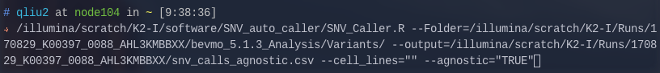
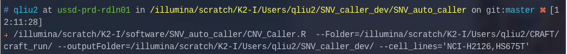

# SNV/CNV Auto Caller 

## Introduction 
This set of script is used to identify SNV Calls (CNV/Fusion under devlopment). It requires input of a folder with variant calling files (vcf)

## Usage 

First you need to log into qlogin
`qlogin`

## SNV_Caller

Input with the Folder with variant files and output path and name 
`/illumina/scratch/K2-I/software/SNV_auto_caller/SNV_Caller.R --Folder=/PATH/TO/bevmo_VERSION_Analysis/Variants/ --output=/PATH/TO/output.csv --cell_lines="CELL_LINE_NAME" --agnostic="TRUE/FALSE"`

SNV Caller takes in 4 arguments 

* `--Folder`: This is the path to Variants after a Bevmo run or any folder that contains .vcf files as suffix.
* `--output`: Path an name of the output *csv* file. If the file name already exist, the programm will stop. Please chose another name. 
* `--cell_lines` : The cell line name you are interested in separated with commas. Please use *COSMIC* Format if there is name conflict between COSMIC and CCLE. _(see Appendix)_
* `--agnostic` : Cell line agnostic mode. Accept TRUE or FALSE. If True, agnostic mode will be on. It will ignore `--cell_lines` flag and will search through the whole CCLE and COSMIC truth table. _NOTE:Agnostic will generate many unneeded data. Use with caution._

### Output
The header of the output is as follows

Cell_Line_Name | Gene |	Chr	| Start | End | Variant_Type | Ref | Alt | Observed variant frequency (1=100%) | Data Source
--- | --- | --- | --- | --- | --- | --- | --- | --- | --- 

## CNV_Caller 
Input with the Folder with variant files and output path and name 
`/illumina/scratch/K2-I/software/SNV_auto_caller/CNV_Caller.R --Folder=/PATH/TO/CRAFT_OUTPUT --outputFolder=/PATH/TO/CNV_output_folder --cell_lines='CELL_LINE_NAMES'`

CNV Caller takes in 4 arguments 

* `--Folder`: This is the path to Variants after a CRAFT run or any folder that contains fold.change. files as prefix.
* `--outputFolder`: Path an name of the output *txt* file. for each cell line and each sample combination the Caller will generate a calling output in the outputFolder
* `--cell_lines` : The cell line name you are interested in separated with commas. Please use *COSMIC* Format if there is name conflict between COSMIC and CCLE. _(see Appendix)_

### Output
The header of the output is as follows

gene | fold_change | t_stat | q_score | num_targets | _cellline-name_ | CCLE_fold_change
--- | --- | --- | --- | --- | --- | ---

## Appedix: 
**Rows are not Aligned**

## Appedix: 
|                |                  | 
|----------------|------------------| 
| CCLE_CELL_LINE | COSMIC_CELL_LINE | 
| A253           |                  | 
|                | A431             | 
| ASPC1          | AsPC-1           | 
| BT474          | BT-474           | 
|                | BxPC-3           | 
| CAPAN1         |                  | 
| CFPAC1         | CFPAC-1          | 
| COLO201        |                  | 
| COLO829        | COLO-829         | 
| DKMG           | DK-MG            | 
| DMS79          | DMS-79           | 
| HCC1143        | HCC1143          | 
| HCC1187        | HCC1187          | 
| HCC1395        | HCC1395          | 
|                | HCC1500          | 
| HCC1599        | HCC1599          | 
|                | HCC1937          | 
| HCC1954        | HCC1954          | 
| HCC2157        | HCC2157          | 
| HCC2218        | HCC2218          | 
| HCC78          |                  | 
| HCC827         |                  | 
| HCT15          | HCT-15           | 
| HEPG2          |                  | 
| HS746T         | Hs746T           | 
| HT29           | HT-29            | 
|                | JAR              | 
| K562           |                  | 
| KARPAS299      | KARPAS-299       | 
| KM12           |                  | 
|                | LC-2-ad          | 
| LOVO           |                  | 
| MCF7           | MCF7             | 
| MDAMB231       | MDA-MB-231       | 
| MDAMB361       | MDA-MB-361       | 
| MDAMB453       | MDA-MB-453       | 
| MDAMB468       | MDA-MB-468       | 
| MHHES1         | MHH-ES-1         | 
| MV411          | MV-4-11          | 
| NCIH146        | NCI-H146         | 
| NCIH1563       | NCI-H1563        | 
| NCIH1650       | NCI-H1650        | 
| NCIH1975       | NCI-H1975        | 
| NCIH2009       | NCI-H2009        | 
| NCIH2122       | NCI-H2122        | 
| NCIH2228       | NCI-H2228        | 
|                | NCI-H3122        | 
| NCIH441        | NCI-H441         | 
| NCIH460        |                  | 
| NCIH596        | NCI-H596         | 
| NCIH660        | NCI-H660         | 
| NCIH716        | NCI-H716         | 
| NCIH727        | NCI-H727         | 
| OCIAML2        | OCI-AML2         | 
|                | OVCAR-3          | 
| OVCAR8         | OVCAR-8          | 
|                | PEO1             | 
| RL             |                  | 
| RL952          | RL95-2           | 
| RT11284        |                  | 
| RT4            |                  | 
| SCC9           | SCC-9            | 
| SKBR3          |                  | 
| SKMEL28        | SK-MEL-28        | 
| SKNMC          |                  | 
| SU8686         | SU8686           | 
| SUDHL1         | SU-DHL-1         | 
| SW1417         | SW1417           | 
| SW48           | SW48             | 
|                | SW626            | 
| SW780          | SW780            | 
| T47D           | T47D             | 
| THP1           | THP-1            | 
|                | TUR              | 
| VCAP           | VCaP             | 
